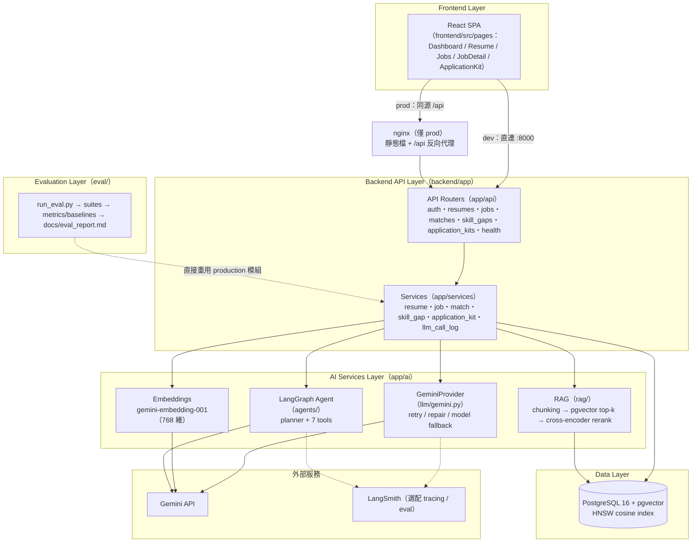
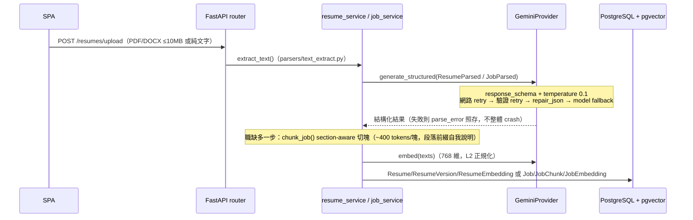
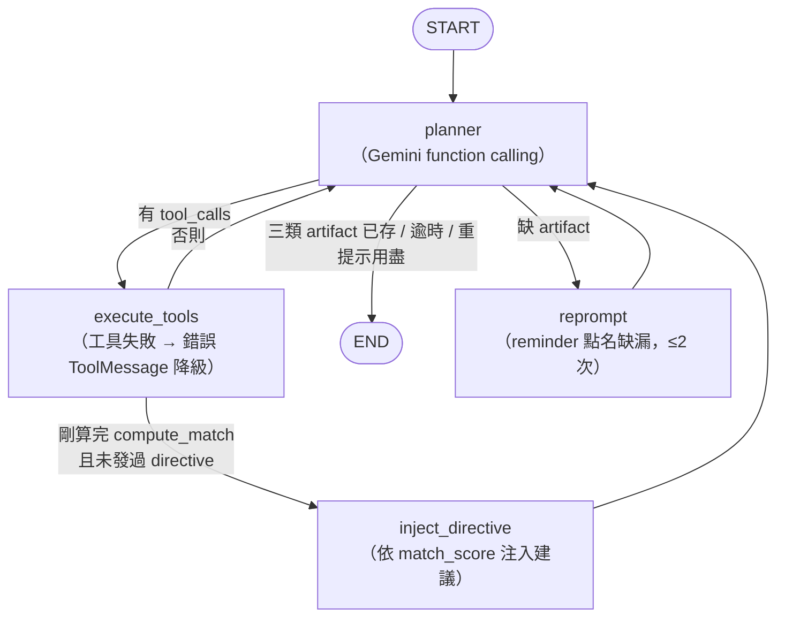
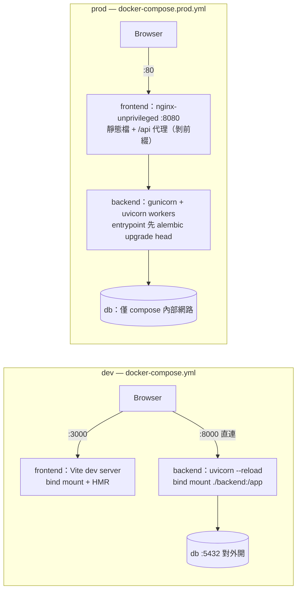

# CareerPilot AI — 系統架構

> 本文件描述 v1.0 的高階架構：分層總覽、兩條關鍵資料流、部署拓撲。
> 對應 [SRS §9](SRS.md#9-architecture-requirements) 的五層架構要求；文中模組路徑皆為 repo 內真實檔案。

---

## 1. 系統分層總覽



各層職責與對應程式碼：

| 層 | 位置 | 職責 |
|---|---|---|
| Frontend | [frontend/src/](../frontend/src/) | React SPA（Vite + TS）；[api/client.ts](../frontend/src/api/client.ts) 統一 axios instance（JWT 附掛、401 refresh、dev/prod baseURL 切換） |
| Backend API | [backend/app/api/](../backend/app/api/) | HTTP 轉接、JWT 驗證（[deps.py](../backend/app/api/deps.py)）、rate limit；業務邏輯全在 services |
| Services | [backend/app/services/](../backend/app/services/) | 編排「解析 → 向量 → 計分 → 生成」鏈路、交易邊界、降級策略（NFR-4）；[llm_call_log_service.py](../backend/app/services/llm_call_log_service.py) 記錄每次 LLM 呼叫的 token / 成本 / fallback |
| AI Services | [backend/app/ai/](../backend/app/ai/) | LLM wrapper（[llm/gemini.py](../backend/app/ai/llm/gemini.py)）、structured output schemas（[parsers/](../backend/app/ai/parsers/)）、prompts、RAG（[rag/](../backend/app/ai/rag/)）、agent（[agents/](../backend/app/ai/agents/)） |
| Data | [backend/app/db/models/](../backend/app/db/models/) + [alembic/](../backend/alembic/) | SQLAlchemy models；向量存 pgvector（`resume_embeddings` / `job_embeddings`，HNSW cosine）；上傳檔案即抽即棄，只保存抽出的 `raw_text`（不落地檔案儲存） |
| Evaluation | [eval/](../eval/) | 25 組人工標註情境（[datasets/scenarios/](../eval/datasets/scenarios/)）、六類 suites（[suites/](../eval/suites/)）、P@K / MRR（[metrics/ranking.py](../eval/metrics/ranking.py)）、TF-IDF keyword 與 no-RAG baselines（[baselines/](../eval/baselines/)）、LLM-as-judge 與 LangSmith 同步（[langsmith/](../eval/langsmith/)）；產出 [eval_report.md](eval_report.md) |

GeminiProvider 的防護鏈（由內到外，全部失守才拋錯）：

1. **網路 retry**（tenacity）：暫時性錯誤指數退避，同一模型最多 3 次嘗試；
2. **驗證 retry**：structured output 不符 Pydantic schema 時重新生成，每模型最多 2 次生成嘗試；
3. **repair_json**：本地修補壞 JSON，不打 API；
4. **Model fallback（FR-58）**：primary（`gemini-3.5-flash-lite`）完整失敗 → fallback（`gemini-3.6-flash`）整套重跑。token / 成本跨所有嘗試加總入 `llm_call_logs`（FR-59）。`embed` 無 fallback——不同 embedding 模型的向量空間互不相容。

---

## 2. 關鍵資料流

### 2.1 履歷 / 職缺 ingestion



- 履歷按 section 組成數段 embedding 文字（[embeddings/resume_texts.py](../backend/app/ai/embeddings/resume_texts.py)）；職缺經 [rag/chunking.py](../backend/app/ai/rag/chunking.py) 切成語意純的 chunks 再逐塊向量化——這是後續 RAG 檢索（skill gap 的 source attribution、agent 的 `retrieve_job_evidence`）的索引基礎。
- 容錯（NFR-4）：解析或 embedding 失敗都**照樣建立記錄**並標記錯誤原因；match 執行時對缺向量的履歷 lazy backfill 再試一次。
- 檢索側是兩段式：pgvector HNSW cosine top-5（[rag/retrieval.py](../backend/app/ai/rag/retrieval.py)）→ cross-encoder `ms-marco-MiniLM-L-6-v2` 精排（[rag/rerank.py](../backend/app/ai/rag/rerank.py)，本地模型零 API 成本；失敗降級為向量排序）。

### 2.2 Application kit agent（LangGraph 7-tool ReAct 迴圈）

[agents/graph.py](../backend/app/ai/agents/graph.py) 編譯的圖形；planner 是 `ChatGoogleGenerativeAI`（temperature 0）以 **Gemini function calling** 在 7 個工具間自由選擇（FR-57：無任何「工具 A 後必然工具 B」的硬連線）：



7 個工具（[agents/tools.py](../backend/app/ai/agents/tools.py)，closure 工廠注入 db / provider，LLM 只看到業務參數）：

| 工具 | 作用 |
|---|---|
| `fetch_resume` | 取得使用者履歷的結構化內容 |
| `retrieve_job_evidence` | RAG 檢索該職缺 chunks（retrieval + rerank） |
| `compute_match` | 執行混合計分（直接呼叫 `match_service.run_matches`），分數同步進 state |
| `generate_tailored_resume` | 生成履歷修改建議（structured） |
| `generate_cover_letter` | 生成求職信（structured） |
| `generate_interview_qs` | 生成面試準備題組（structured） |
| `save_artifact` | 將指定 artifact 寫入 DB（逐 artifact commit，中途失敗已存者仍有效） |

**Match-score 條件分流（FR-49）**：`compute_match` 完成後注入一次 `[directive]` 訊息——是建議而非強制路徑，最終選擇權在 LLM：

| 分數 | directive 內容 |
|---|---|
| < 0.5 | gap-first：先 `retrieve_job_evidence` 確認差距，建議聚焦補洞 |
| 0.5 ~ 0.8 | 自行判斷是否需要更多 evidence |
| ≥ 0.8 | 可跳過額外檢索，直接生成三類 artifacts |

**防護（FR-57 允許的唯二流程干預之外）**：總時限 `KIT_DEADLINE_SECONDS = 240`（planner 每輪開工前檢查）、`KIT_RECURSION_LIMIT = 50`（防 LLM 鬼打牆）、完成檢查缺件最多 reprompt 2 次後以 partial 收場。每輪 planner 呼叫都入 `llm_call_logs`；設定 `LANGSMITH_TRACING=true` 時完整 trace 上報 LangSmith。

---

## 3. 部署拓撲



| 面向 | dev（[docker-compose.yml](../docker-compose.yml)） | prod（[docker-compose.prod.yml](../docker-compose.prod.yml)） |
|---|---|---|
| image 來源 | 本地 build（[backend/Dockerfile](../backend/Dockerfile)、[frontend/Dockerfile](../frontend/Dockerfile)） | GHCR：`ghcr.io/mhong26/careerpilot-{backend,frontend}`（也可 `up --build` 本地建 [Dockerfile.prod](../backend/Dockerfile.prod)） |
| 程式碼 | bind mount（`./backend:/app`、`./frontend:/app`），改檔即生效 | 烘進 image 的不可變成品，無任何掛載 |
| 前端服務 | Vite dev server :3000（HMR） | `npm run build` 靜態檔由 [nginx-unprivileged](../frontend/Dockerfile.prod) 服務（:8080，non-root） |
| API 路徑 | `VITE_API_URL=http://localhost:8000` 直連 | 不設 `VITE_API_URL` → 相對路徑 `/api`，[nginx.conf](../frontend/nginx.conf) 代理到 `backend:8000` 並剝掉前綴（同源，無 CORS） |
| 後端進程 | 單進程 `uvicorn --reload` | gunicorn + uvicorn workers（`WEB_CONCURRENCY`，預設 2；`--timeout 300` 容納 kit 長任務），worker crash 自動補 |
| migration | 手動：`docker compose exec backend alembic upgrade head` | 自動：[entrypoint.sh](../backend/entrypoint.sh) 啟動時 `alembic upgrade head`（冪等，失敗即 fail fast） |
| 對外 port | 3000 / 8000 / 5432 全開 | 僅 nginx 映射 `${FRONTEND_PORT:-80}`；backend 與 db 只在內部網路 |
| 自癒 | 無 | 全服務 `restart: unless-stopped` |
| 執行身分 | root（容器預設） | backend `appuser`（uid 1000）、frontend nginx-unprivileged（uid 101） |

**CD 發佈流（[.github/workflows/cd.yml](../.github/workflows/cd.yml)）**：push `main` 或 tag `v*` → 以 `workflow_call` 重跑完整 CI（lint + tests + secret scan，紅燈即不發佈）→ buildx + QEMU 建 multi-arch image（`linux/amd64` + `linux/arm64`）→ 推 GHCR。標籤策略：`sha-<short-commit>`（7 碼短 SHA，如 `sha-90dd603`，永遠可追溯）、`latest`（僅 main）、semver（`v1.0.0` → `1.0.0` / `1.0` / `1`）。部署端只需：

```bash
docker compose -f docker-compose.prod.yml pull && docker compose -f docker-compose.prod.yml up -d
docker compose -f docker-compose.prod.yml exec backend python scripts/seed.py   # 可選：demo 資料
```

---

## 4. Evaluation Layer

[eval/](../eval/) 與 production 程式碼同倉但獨立可跑：`python eval/run_eval.py` → 冪等 seed（獨立 `careerpilot_eval` DB）→ 六類 suites（matching ranking、RAG retrieval、hallucination、kit rubric——由 `kit_generation` 產生受測物＋`rubric` LLM-as-judge 評分兩個模組組成、reliability、system）→ 對比 baselines（TF-IDF keyword ranking、no-RAG skill gap）→ 自動生成 [docs/eval_report.md](eval_report.md)。設計重點：suites **直接 import production services**（測的就是真系統，不是複本）；所有 LLM / embedding 呼叫走磁碟快取，重跑零 API 成本；judge 額度耗盡標 partial 不炸整輪，隔日續跑。
