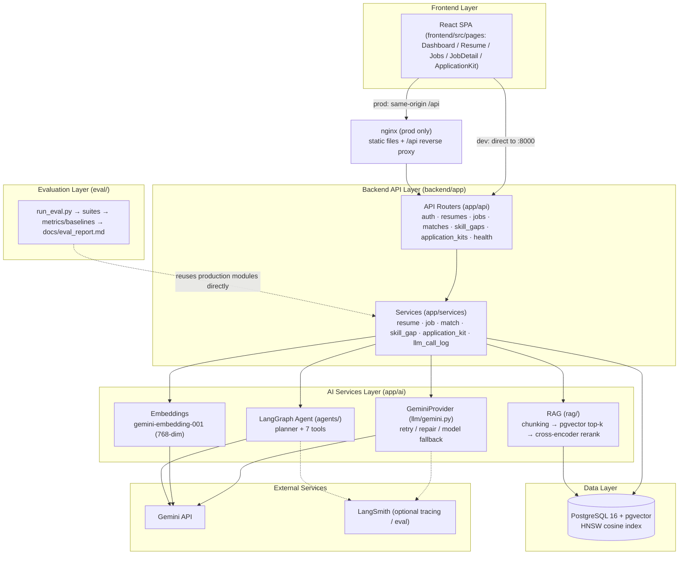
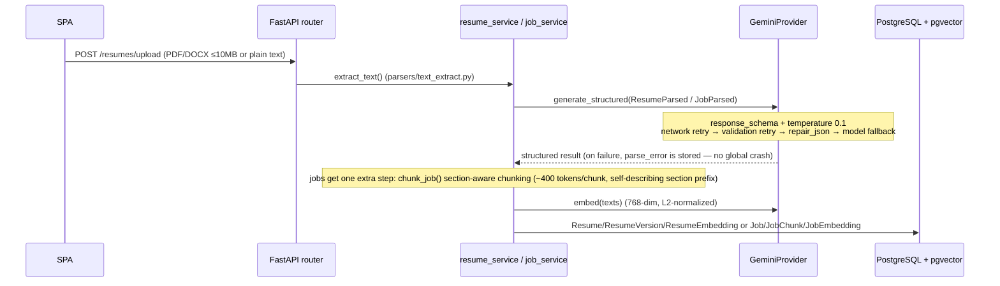
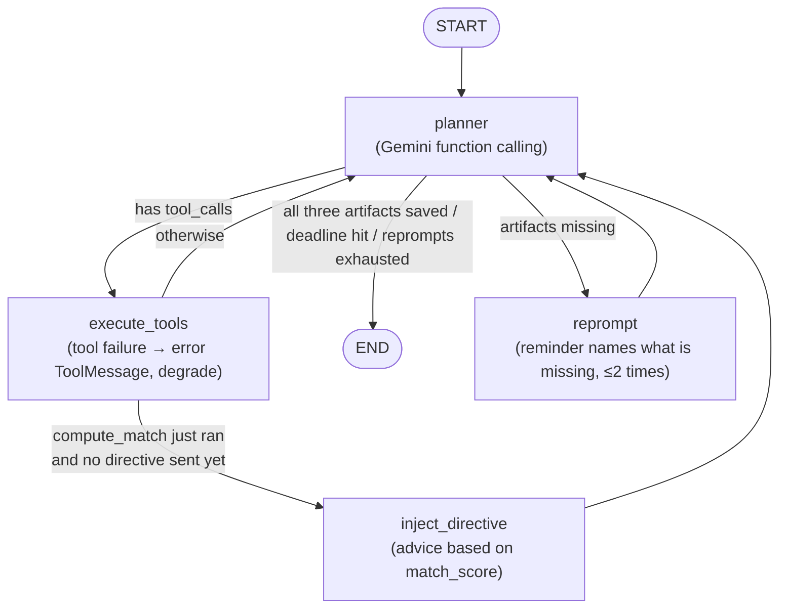
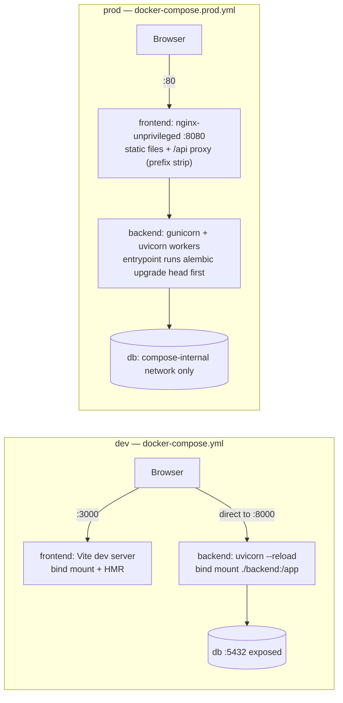

# CareerPilot AI — System Architecture

> This document describes the high-level architecture of v1.0: the layer overview, the two
> key data flows, and the deployment topology.
> It maps to the five-layer architecture required by [SRS §9](SRS.md#9-architecture-requirements);
> every module path mentioned below is a real file in this repo.

---

## 1. Layer Overview



Responsibilities per layer and where the code lives:

| Layer | Location | Responsibility |
|---|---|---|
| Frontend | [frontend/src/](../frontend/src/) | React SPA (Vite + TS); [api/client.ts](../frontend/src/api/client.ts) provides the shared axios instance (JWT attachment, 401 refresh, dev/prod baseURL switching) |
| Backend API | [backend/app/api/](../backend/app/api/) | HTTP adaptation, JWT verification ([deps.py](../backend/app/api/deps.py)), rate limiting; all business logic lives in services |
| Services | [backend/app/services/](../backend/app/services/) | Orchestrates the parse → embed → score → generate pipeline, transaction boundaries, degradation strategy (NFR-4); [llm_call_log_service.py](../backend/app/services/llm_call_log_service.py) records tokens / cost / fallback for every LLM call |
| AI Services | [backend/app/ai/](../backend/app/ai/) | LLM wrapper ([llm/gemini.py](../backend/app/ai/llm/gemini.py)), structured output schemas ([parsers/](../backend/app/ai/parsers/)), prompts, RAG ([rag/](../backend/app/ai/rag/)), agent ([agents/](../backend/app/ai/agents/)) |
| Data | [backend/app/db/models/](../backend/app/db/models/) + [alembic/](../backend/alembic/) | SQLAlchemy models; vectors stored in pgvector (`resume_embeddings` / `job_embeddings`, HNSW cosine); uploaded files are extracted then discarded — only the extracted `raw_text` is persisted (no file storage) |
| Evaluation | [eval/](../eval/) | 25 hand-annotated scenarios ([datasets/scenarios/](../eval/datasets/scenarios/)), six suites ([suites/](../eval/suites/)), P@K / MRR ([metrics/ranking.py](../eval/metrics/ranking.py)), TF-IDF keyword and no-RAG baselines ([baselines/](../eval/baselines/)), LLM-as-judge and LangSmith sync ([langsmith/](../eval/langsmith/)); produces [eval_report.md](eval_report.md) |

GeminiProvider's defense chain (inner to outer; an error is raised only when every layer fails):

1. **Network retry** (tenacity): exponential backoff on transient errors, up to 3 attempts per model;
2. **Validation retry**: regenerate when structured output fails Pydantic schema validation, up to 2 generation attempts per model;
3. **repair_json**: locally repair broken JSON without calling the API;
4. **Model fallback (FR-58)**: when the primary (`gemini-3.5-flash-lite`) fails completely → rerun the whole pipeline on the fallback (`gemini-3.6-flash`). Tokens / cost are summed across all attempts into `llm_call_logs` (FR-59). `embed` has no fallback — vector spaces of different embedding models are incompatible.

---

## 2. Key Data Flows

### 2.1 Resume / Job Ingestion



- Resumes are assembled into a few embedding texts per section ([embeddings/resume_texts.py](../backend/app/ai/embeddings/resume_texts.py)); jobs are split by [rag/chunking.py](../backend/app/ai/rag/chunking.py) into semantically clean chunks and embedded chunk by chunk — this is the index that powers later RAG retrieval (source attribution for skill gaps, and the agent's `retrieve_job_evidence`).
- Fault tolerance (NFR-4): parse or embedding failures **still create the record** with the error reason attached; at match time, resumes with missing vectors get a lazy backfill retry.
- Retrieval is two-stage: pgvector HNSW cosine top-5 ([rag/retrieval.py](../backend/app/ai/rag/retrieval.py)) → cross-encoder `ms-marco-MiniLM-L-6-v2` reranking ([rag/rerank.py](../backend/app/ai/rag/rerank.py), a local model with zero API cost; on failure it degrades to vector order).

### 2.2 Application Kit Agent (LangGraph 7-tool ReAct loop)

The graph compiled in [agents/graph.py](../backend/app/ai/agents/graph.py); the planner is `ChatGoogleGenerativeAI` (temperature 0) choosing freely among 7 tools via **Gemini function calling** (FR-57: no hard-wired "tool A must be followed by tool B" sequencing):



The 7 tools ([agents/tools.py](../backend/app/ai/agents/tools.py); a closure factory injects db / provider so the LLM only sees business parameters):

| Tool | Purpose |
|---|---|
| `fetch_resume` | Fetch the user's structured resume content |
| `retrieve_job_evidence` | RAG retrieval over the job's chunks (retrieval + rerank) |
| `compute_match` | Run hybrid scoring (calls `match_service.run_matches` directly); the score is synced into state |
| `generate_tailored_resume` | Generate resume tailoring suggestions (structured) |
| `generate_cover_letter` | Generate a cover letter (structured) |
| `generate_interview_qs` | Generate interview prep questions (structured) |
| `save_artifact` | Persist a given artifact to the DB (committed per artifact; earlier saves survive a mid-run failure) |

**Match-score conditional routing (FR-49)**: after `compute_match` completes, a single `[directive]` message is injected — it is advice, not a forced path; the final choice stays with the LLM:

| Score | Directive |
|---|---|
| < 0.5 | Gap-first: run `retrieve_job_evidence` to confirm the gaps; focus on closing them |
| 0.5 – 0.8 | Use your own judgment on whether more evidence is needed |
| ≥ 0.8 | Extra retrieval can be skipped; generate the three artifacts directly |

**Guards (the only flow interventions FR-57 permits besides the directive)**: overall deadline `KIT_DEADLINE_SECONDS = 240` (checked before each planner round), `KIT_RECURSION_LIMIT = 50` (stops LLM loops), and the completion check reprompts at most 2 times before finishing as partial. Every planner call is recorded in `llm_call_logs`; with `LANGSMITH_TRACING=true` the full trace is reported to LangSmith.

---

## 3. Deployment Topology



| Aspect | dev ([docker-compose.yml](../docker-compose.yml)) | prod ([docker-compose.prod.yml](../docker-compose.prod.yml)) |
|---|---|---|
| Image source | Local build ([backend/Dockerfile](../backend/Dockerfile), [frontend/Dockerfile](../frontend/Dockerfile)) | GHCR: `ghcr.io/mhong26/careerpilot-{backend,frontend}` (or `up --build` to build [Dockerfile.prod](../backend/Dockerfile.prod) locally) |
| Code | Bind mounts (`./backend:/app`, `./frontend:/app`); edits take effect immediately | Immutable artifact baked into the image; no mounts |
| Frontend serving | Vite dev server :3000 (HMR) | `npm run build` static files served by [nginx-unprivileged](../frontend/Dockerfile.prod) (:8080, non-root) |
| API path | `VITE_API_URL=http://localhost:8000` direct | `VITE_API_URL` unset → relative path `/api`; [nginx.conf](../frontend/nginx.conf) proxies to `backend:8000` and strips the prefix (same origin, no CORS) |
| Backend process | Single-process `uvicorn --reload` | gunicorn + uvicorn workers (`WEB_CONCURRENCY`, default 2; `--timeout 300` accommodates long kit runs); crashed workers are respawned |
| Migrations | Manual: `docker compose exec backend alembic upgrade head` | Automatic: [entrypoint.sh](../backend/entrypoint.sh) runs `alembic upgrade head` on startup (idempotent; fails fast on error) |
| Exposed ports | 3000 / 8000 / 5432 all exposed | Only nginx maps `${FRONTEND_PORT:-80}`; backend and db stay on the internal network |
| Self-healing | None | All services `restart: unless-stopped` |
| Runtime identity | root (container default) | backend `appuser` (uid 1000), frontend nginx-unprivileged (uid 101) |

**CD publish flow ([.github/workflows/cd.yml](../.github/workflows/cd.yml))**: push to `main` or tag `v*` → re-run the full CI via `workflow_call` (lint + tests + secret scan; a red gate blocks publishing) → buildx + QEMU builds multi-arch images (`linux/amd64` + `linux/arm64`) → push to GHCR. Tag strategy: `sha-<short-commit>` (7-char short SHA, e.g. `sha-90dd603`; always traceable), `latest` (main only), semver (`v1.0.0` → `1.0.0` / `1.0` / `1`). Deployment is just:

```bash
docker compose -f docker-compose.prod.yml pull && docker compose -f docker-compose.prod.yml up -d
docker compose -f docker-compose.prod.yml exec backend python scripts/seed.py   # optional: demo data
```

---

## 4. Evaluation Layer

[eval/](../eval/) lives in the same repo as production code but runs independently: `python eval/run_eval.py` → idempotent seeding (into a dedicated `careerpilot_eval` DB) → six suites (matching ranking, RAG retrieval, hallucination, kit rubric — composed of `kit_generation` which produces the material under test plus `rubric` which scores it via LLM-as-judge — reliability, system) → comparison against baselines (TF-IDF keyword ranking, no-RAG skill gap) → auto-generates [docs/eval_report.md](eval_report.md). Design highlights: suites **import production services directly** (what gets measured is the real system, not a copy); all LLM / embedding calls go through a disk cache, so re-runs cost zero API budget; judge quota exhaustion marks a suite partial instead of failing the whole run, resuming the next day.
