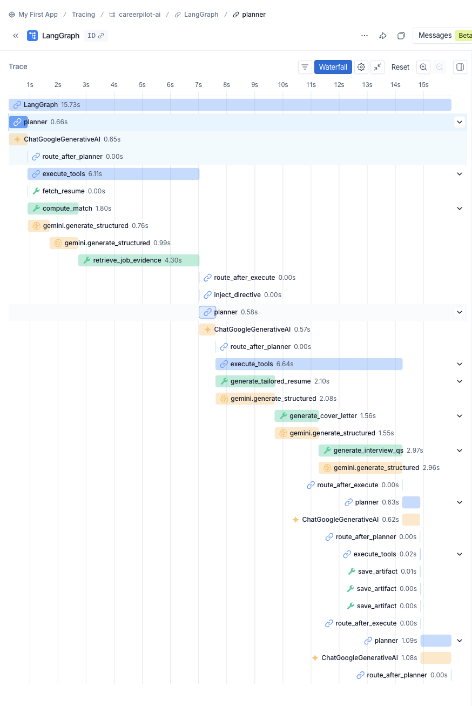

# CareerPilot AI — Evaluation Report

_Generated by `python eval/run_eval.py` (Phase 8). Do not edit by hand._

| Run info | |
|---|---|
| Generated at | 2026-08-07T17:53:13+00:00 |
| Git commit | unknown |
| Scenarios in dataset | 25 |
| Scenario limit this run | none |
| LLM cache | enabled |
| Mode | online |
| Judge model | gemini-3.6-flash |

Suites can be (re-)run independently and on different days (free-tier quota); each section below shows the latest collected result for that suite.

## 1. Job matching — Precision@K / MRR vs TF-IDF baseline

**Job matching — hybrid vs TF-IDF baseline (n=25 scenarios)**

| Metric | Hybrid | TF-IDF baseline | Improvement |
|---|---|---|---|
| Precision@3 | 0.720 | 0.720 | +0.0% |
| Precision@5 | 0.432 | 0.432 | +0.0% |
| MRR | 1.000 | 1.000 | +0.0% |
| NDCG@3 (graded) | 0.934 | 0.936 | -0.2% |
| NDCG@5 (graded) | 0.935 | 0.955 | -2.0% |

**Case-family breakdown (where the two systems should diverge)**

| Family | n | Hybrid NDCG@5 | TF-IDF NDCG@5 | Hybrid P@3 | TF-IDF P@3 |
|---|---|---|---|---|---|
| semantic-no-overlap scenarios | 11 | 0.977 | 0.977 | 0.727 | 0.727 |
| keyword-trap scenarios | 11 | 0.926 | 0.917 | 0.697 | 0.697 |

**Per-scenario detail**

| Scenario | Hybrid NDCG@5 | TF-IDF NDCG@5 | Hybrid P@3 | TF-IDF P@3 | Hybrid RR | TF-IDF RR |
|---|---|---|---|---|---|---|
| s01 | 0.972 | 0.951 | 0.667 | 0.667 | 1.000 | 1.000 |
| s02 | 1.000 | 0.864 | 1.000 | 1.000 | 1.000 | 1.000 |
| s03 | 0.843 | 0.993 | 0.667 | 0.667 | 1.000 | 1.000 |
| s04 | 1.000 | 1.000 | 0.667 | 0.667 | 1.000 | 1.000 |
| s05 | 1.000 | 1.000 | 0.667 | 0.667 | 1.000 | 1.000 |
| s06 | 1.000 | 0.993 | 0.667 | 0.667 | 1.000 | 1.000 |
| s07 | 1.000 | 0.993 | 0.667 | 0.667 | 1.000 | 1.000 |
| s08 | 1.000 | 0.972 | 0.667 | 0.667 | 1.000 | 1.000 |
| s09 | 0.843 | 0.993 | 0.667 | 0.667 | 1.000 | 1.000 |
| s10 | 1.000 | 0.951 | 0.667 | 0.667 | 1.000 | 1.000 |
| s11 | 0.972 | 0.972 | 0.667 | 0.667 | 1.000 | 1.000 |
| s12 | 1.000 | 0.843 | 0.667 | 0.667 | 1.000 | 1.000 |
| s13 | 0.972 | 1.000 | 0.667 | 0.667 | 1.000 | 1.000 |
| s14 | 0.843 | 0.843 | 0.667 | 0.667 | 1.000 | 1.000 |
| s15 | 0.843 | 0.835 | 0.667 | 0.667 | 1.000 | 1.000 |
| s16 | 1.000 | 0.993 | 0.667 | 0.667 | 1.000 | 1.000 |
| s17 | 0.843 | 0.843 | 0.667 | 0.667 | 1.000 | 1.000 |
| s18 | 0.864 | 1.000 | 1.000 | 1.000 | 1.000 | 1.000 |
| s19 | 0.843 | 0.835 | 0.667 | 0.667 | 1.000 | 1.000 |
| s20 | 1.000 | 1.000 | 0.667 | 0.667 | 1.000 | 1.000 |
| s21 | 0.843 | 0.993 | 0.667 | 0.667 | 1.000 | 1.000 |
| s22 | 0.864 | 1.000 | 1.000 | 1.000 | 1.000 | 1.000 |
| s23 | 1.000 | 1.000 | 0.667 | 0.667 | 1.000 | 1.000 |
| s24 | 0.972 | 1.000 | 0.667 | 0.667 | 1.000 | 1.000 |
| s25 | 0.864 | 1.000 | 1.000 | 1.000 | 1.000 | 1.000 |

Notes:
- Precision@K uses the classic fixed-K denominator; with fewer than K relevant jobs per scenario the attainable ceiling is below 1.0 for both systems equally.
- NDCG uses the full 0-3 graded annotations with (2^grade - 1) gain and log2 position discounting; it separates orderings that binarized P@K cannot (e.g. a keyword-trap job ranked 2nd vs last when both systems still place the relevant jobs inside the top 3).
- Reference target for improvement over the keyword baseline: +35% (measure-and-report, not a pass/fail gate).
- Hybrid scores include one LLM semantic-equivalence + one explanation call per pair, frozen at their first successful outcome by the eval cache — re-runs are reproducible by construction; use --no-cache to measure run-to-run variance.

_Collected: 2026-08-04T18:18:29+00:00_

## 2. RAG retrieval — Precision@K / MRR, rerank ablation

**Skill-gap retrieval — before vs after rerank (n=25 scenarios)**

| Metric | Vector order (pre-rerank) | Cross-encoder order (post) |
|---|---|---|
| Precision@3 | 0.613 | 0.667 |
| Precision@5 | 0.600 | 0.600 |
| MRR | 0.980 | 0.980 |

**Per-scenario detail**

| Scenario | Pre P@3 | Post P@3 | Pre RR | Post RR | Rerank used |
|---|---|---|---|---|---|
| s01 | 0.333 | 0.667 | 1.000 | 1.000 | yes |
| s02 | 0.667 | 0.667 | 1.000 | 1.000 | yes |
| s03 | 0.667 | 0.667 | 1.000 | 1.000 | yes |
| s04 | 0.333 | 0.667 | 1.000 | 1.000 | yes |
| s05 | 0.667 | 0.667 | 1.000 | 1.000 | yes |
| s06 | 0.667 | 0.667 | 1.000 | 1.000 | yes |
| s07 | 0.667 | 0.667 | 1.000 | 1.000 | yes |
| s08 | 0.667 | 0.667 | 1.000 | 1.000 | yes |
| s09 | 0.667 | 0.667 | 1.000 | 1.000 | yes |
| s10 | 0.667 | 0.667 | 1.000 | 1.000 | yes |
| s11 | 0.667 | 0.667 | 1.000 | 1.000 | yes |
| s12 | 0.667 | 0.667 | 1.000 | 1.000 | yes |
| s13 | 0.667 | 0.667 | 1.000 | 1.000 | yes |
| s14 | 0.667 | 0.667 | 0.500 | 0.500 | yes |
| s15 | 0.667 | 0.667 | 1.000 | 1.000 | yes |
| s16 | 0.667 | 0.667 | 1.000 | 1.000 | yes |
| s17 | 0.667 | 0.667 | 1.000 | 1.000 | yes |
| s18 | 0.667 | 0.667 | 1.000 | 1.000 | yes |
| s19 | 0.667 | 0.667 | 1.000 | 1.000 | yes |
| s20 | 0.667 | 0.667 | 1.000 | 1.000 | yes |
| s21 | 0.333 | 0.667 | 1.000 | 1.000 | yes |
| s22 | 1.000 | 0.667 | 1.000 | 1.000 | yes |
| s23 | 0.667 | 0.667 | 1.000 | 1.000 | yes |
| s24 | 0.333 | 0.667 | 1.000 | 1.000 | yes |
| s25 | 0.333 | 0.667 | 1.000 | 1.000 | yes |

Notes:
- Rerank applied in 100% of runs (model: cross-encoder/ms-marco-MiniLM-L-6-v2; when unavailable the service degrades to vector order, making pre == post for that scenario).
- Retrieval is top-k=5 over each job's chunks; chunk-level ground truth is annotated only for the skill-gap query of each scenario (binary relevance).

_Collected: 2026-08-04T18:18:37+00:00_

## 3. Hallucination detection — LLM-as-judge (RAG vs no-RAG)

> **Judge caveat (self-grading):** the judge model (`gemini-3.6-flash`) belongs to the same model family as — and is the production fallback for — the generator (`gemini-3.5-flash-lite`). Same-family judges can be systematically blind to their family's characteristic errors, so absolute rates may be optimistic; the RAG vs no-RAG *comparison* (same judge on both sides) is the more trustworthy signal.

**Hallucination rate — RAG skill-gap vs no-RAG direct generation**

| System | Hallucination rate (unsupported/judged) | Supported | Partially | Unsupported | Unjudged |
|---|---|---|---|---|---|
| RAG (production) | 0.0% (0/115) | 110 | 5 | 0 | 0 |
| No-RAG baseline | 44.1% (30/68) | 30 | 8 | 30 | 0 |

**Judge-free hallucination signals**

| Signal | Value |
|---|---|
| Claims naming a skill the resume clearly has (RAG) | 0 |
| Claims naming a skill the resume clearly has (no-RAG) | 0 |
| Gaps dropped by citation validation (RAG, dropped_gap_count) | 0 |

Notes:
- The no-RAG baseline never sees the posting text, but its claims are judged against the job's FULL chunk text (the most charitable evidence set) — this biases the comparison against RAG, so a measured improvement is conservative.
- One judge call covers all claims of one report (claims batched into a single prompt) — 2 calls per scenario across both experiments.

_Collected: 2026-08-04T20:24:01+00:00_

## 4. Resume-suggestion quality — rubric scores

> **Judge caveat (self-grading):** the judge model (`gemini-3.6-flash`) belongs to the same model family as — and is the production fallback for — the generator (`gemini-3.5-flash-lite`). Same-family judges can be systematically blind to their family's characteristic errors, so absolute rates may be optimistic; the RAG vs no-RAG *comparison* (same judge on both sides) is the more trustworthy signal.

**Rubric scores — tailored-resume suggestions (n=25 artifacts)**

| Dimension | Mean (1-5) | Distribution (1/2/3/4/5) |
|---|---|---|
| relevance | 4.04 | 0 / 0 / 8 / 8 / 9 |
| specificity | 4.20 | 0 / 0 / 5 / 10 / 10 |
| actionability | 4.24 | 0 / 0 / 5 / 9 / 11 |
| alignment | 2.20 | 10 / 6 / 5 / 2 / 2 |
| **overall** | 3.67 |  |

**Per-scenario scores**

| Scenario | relevance | specificity | actionability | alignment |
|---|---|---|---|---|
| s01 | 3 | 3 | 3 | 1 |
| s02 | 5 | 5 | 5 | 5 |
| s03 | 4 | 4 | 4 | 1 |
| s04 | 3 | 4 | 4 | 1 |
| s05 | 5 | 5 | 5 | 3 |
| s06 | 4 | 4 | 3 | 2 |
| s07 | 3 | 3 | 3 | 1 |
| s08 | 4 | 4 | 4 | 3 |
| s09 | 3 | 4 | 4 | 1 |
| s10 | 4 | 4 | 4 | 2 |
| s11 | 3 | 3 | 3 | 1 |
| s12 | 5 | 5 | 5 | 4 |
| s13 | 4 | 5 | 5 | 2 |
| s14 | 5 | 4 | 5 | 5 |
| s15 | 3 | 3 | 3 | 1 |
| s16 | 5 | 5 | 5 | 3 |
| s17 | 4 | 3 | 4 | 1 |
| s18 | 5 | 5 | 5 | 4 |
| s19 | 5 | 5 | 5 | 2 |
| s20 | 5 | 5 | 5 | 3 |
| s21 | 3 | 4 | 4 | 1 |
| s22 | 3 | 4 | 4 | 2 |
| s23 | 4 | 5 | 5 | 2 |
| s24 | 4 | 5 | 5 | 1 |
| s25 | 5 | 4 | 4 | 3 |

Notes:
- Fixed rubric with 1/3/5 anchors per dimension (see eval/langsmith/evaluators.py); the judge is instructed to score strictly and reserve 5 for excellent work.

_Collected: 2026-08-04T20:21:12+00:00_

## 5. Reliability — malformed-response & fallback rates

**Malformed-response rates (structured-output calls, live traffic only)**

| Metric | Value |
|---|---|
| Raw malformed rate (first attempt failed) | 0.00% (0/450) |
| Final malformed rate (target < 1%, measure-and-report) | 0.00% (0/450) |
| Repair (JSON fix) usage rate | 0.00% (0/450) |
| Model fallback trigger rate | 0.00% (0/450) |
| Error rate incl. transport errors | 0.00% (0/450) |

**Per-operation call ledger (LLMCallLog, live traffic only)**

| Operation | Calls | Errors | Fallbacks | Tokens in | Tokens out | Est. cost (USD) |
|---|---|---|---|---|---|---|
| embed | 248 | 23 | 0 | 0 | 0 | 0.0000 |
| generate_structured | 450 | 0 | 0 | 138007 | 67961 | 0.2113 |

Notes:
- Raw rate caveat: `attempts` counts both schema-validation retries and transport-level model switches, so transport failures inflate the raw rate — it is a conservative upper bound on true first-attempt malformed output.
- Rows with model marked '+cached' (eval cache hits) are excluded everywhere; they represent replayed results, not live API behaviour.

_Collected: 2026-08-04T18:18:44+00:00_

## 6. System metrics — latency, error rate, coverage

**Operation latency — harness wall-clock (cold samples only)**

| Operation | n | p50 | p95 |
|---|---|---|---|
| Resume embedding (per resume) | 40 | 0.31s | 3.35s |
| Job indexing (per job: chunk + embed + persist) | 208 | 0.29s | 0.54s |
| Match run (per scenario: 8 jobs scored + explained) | 25 | 14.02s | 38.49s |
| Skill-gap analysis (retrieve + rerank + generate) | 25 | 2.14s | 2.68s |
| Application-kit generation (tailored resume) | 25 | 2.24s | 3.17s |

**Per-LLM-call latency — LLMCallLog (live traffic only)**

| Operation | Calls | p50 | p95 | Errors | Error rate |
|---|---|---|---|---|---|
| embed | 248 | 2776ms | 4156ms | 23 | 9.27% |
| generate_structured | 450 | 6247ms | 7333ms | 0 | 0.00% |

**Quality gates**

| Metric | Value |
|---|---|
| Backend test coverage (working target >= 80%) | 94.7% |

Notes:
- Resume parsing latency caveat: eval seeds structured resumes by design (to keep ground truth frozen), so end-to-end parse latency is not exercised here; the generate_structured row in the per-call table is the closest proxy for the LLM portion of parsing.
- Wall-clock percentiles use only samples whose operation made at least one live API call; warm-cache replays are excluded as they measure nothing real. Client-side free-tier pacing sleep (EVAL_GEN_MIN_INTERVAL) is subtracted from every sample — it is quota management, not system latency.

_Collected: 2026-08-04T18:19:32+00:00_

## Appendix A. Rubric input generation

**Tailored-resume artifact generation (rubric inputs)**

| Generated this run | Reused from cache | Failed |
|---|---|---|
| 1 | 24 | 0 |

Notes:
- Artifacts are produced via the same prompt builder and schema as the Phase-7 agent's generate_tailored_resume tool; agent orchestration itself is covered by the backend test suite, so rubric scoring targets artifact quality in isolation.

_Collected: 2026-08-04T18:18:44+00:00_

## Appendix B. LangSmith traces

Agent run trace (LLM function-call tool selection + match-score routing), captured from the LangSmith project:

